# jenkins-dynamic-agents-k8s

# Requirements:
- A functional kubernetes cluster
- Rancher installed on the cluster

## Introduction:

In this article we will launch dynamic Jenkins agents as pods using the kubernetes plugin; the agents will run jobs, and then auto-delete themselves. This practice is also known as distributed jenkins builds.

The motivation behind such a plugin is so that we can adhere to the controller/worker architecture that Jenkins was originally designed around, where the jenkins master assumes the role of a controller who off-loads work on to workers. This allows the jenkins master to focus on monitoring the builds without having to expend CPU by running jobs. This allows for scalability of jobs, where we can run many jobs at the same time without overburdening the jenkins master.

## Brief:

We will create a service account via RBAC (Role Based Authentication Control) that provides admin privileges to our jenkins master deployment. We will then login to jenkins and download the kubernetes plugin for distributed jenkins builds, thereafter configuring the jenkins master to that affect. We will then run an agent that runs a job, and observe its due self-deletion after it has completed said job.

## 1. Create an admin service account via RBAC and assign it to the jenkins deployment

Similar to how we must create service accounts in GCP or iam roles in AWS to permit Terraform to spin up machines on the hypervisor, we must also configure RBAC to allow the jenkins master to spin up agents on our cluster. In this case, we will grant the jenkins master admin permissions.

First, `git clone` this repository and take a look at the admin-account.yaml file:

```
---
apiVersion: v1
kind: ServiceAccount
metadata:
  name: admin-account
```

This is our service account, create it by executing `kubectl apply -f admin-account.yaml`. However, at the moment, it has no role attached to it, so it is basically dead. Let us attach a clusterrole to this service account. Run `kubectl get clusterroles` to view the available default roles:

```
NAME                                                                   AGE
admin                                                                  4d22h
calico-kube-controllers                                                4d22h
calico-node                                                            4d22h
cattle-admin                                                           4d19h
cluster-admin                                                          4d22h
...
```

Let us explore the `cluster-admin` role. Run `kubectl describe clusterrole cluster-admin:`

```
Name:         cluster-admin
Labels:       kubernetes.io/bootstrapping=rbac-defaults
Annotations:  rbac.authorization.kubernetes.io/autoupdate: true
PolicyRule:
  Resources  Non-Resource URLs  Resource Names  Verbs
  ---------  -----------------  --------------  -----
  *.*        []                 []              [*]
             [*]                []              [*]
 ```

The `*.*` beneath resources suggests that this role has permissions to alter all resources in our cluster. Let us select this for the sake of simplicity.

We will now assign the cluster role `cluster-admin` to our service account `admin-account` by creating a clusterrolebinding (the clusterrolebinding acts as a kind of 'glue' that sticks them together):

`kubectl create clusterrolebinding assign-cluster-admin-to-admin-account   --clusterrole=cluster-admin   --serviceaccount=default:admin-account`

When specfying the serviceaccount in the above command, it must be in the format `--serviceaccount=<Namespace>:<Service-Account>`, in our case it is ` --serviceaccount=default:admin-account`.

We are now ready to deploy our jenkins master with this service account.

## 2. Deploy the Jenkins master with the admin service account

The syntax for deploying a jenkins master with a service account is viewable in the jenkins.yaml file, reploduced below for ease (omitted the service for readability):

```
---
apiVersion: extensions/v1beta1
kind: Deployment
metadata:
  name: jenkins-auto-ci
spec:
  replicas: 1
  template:
    metadata:
      labels:
        app: jenkins-auto-ci
    spec:
      serviceAccountName: admin-account
      containers:
      - name: jenkins-auto
        image: jenkins/jenkins
        env:
        - name: GET_HOSTS_FROM
          value: dns
        ports:
        - name: http-port
          containerPort: 80
        - name: jnlp-port
          containerPort: 50000
```

Execute `kubectl apply -f jenkins.yaml` to deploy your jenkins. Now we can access jenkins by taking the NodePort from `kubectl get svc` together with the IP of the worker node and pasting it into the browser: `http://<worker node IP>:<NodePort>`.

*NOTE:* Please ensure your Jenkins master has its state persisted for production/development use cases. For instructions on how to do so, please see: https://github.com/ilyashusain/vmware_dynamic_persistent_vols_k8s.

## 3. Log into the Jenkins master container

Since the Jenkins master is containerized in a kubernetes cluster, there are additional steps we must enact to retrieve the password. First, ssh into the node that hosts the jenkins deployment:

`ssh <worker node ip where jenkins deployed>`
  
Then list the running containers and search for your jenkins container:

`sudo docker ps -a | head -6 #search for ID of jenkins container`

Finally, ssh into this container:

`sudo docker exec -it -u root <docker ID of jenkins-auto-ci> /bin/bash`

and run:

`cat /var/lib/jenkins/secrets/initialAdminPassword`

and follow the instructions in the browser to setup jenkins.

## 4. Install the Kubernetes plugin

In the Jenkins UI, navigate to Manage Jenkins > Plugins, and install the Kubernetes plugin from the list of available plugins. Let Jenkins restart.

## 5. Configure Jenkins

### 5.1:

Log back into jenkins and navigate to Manage Jenkins > Configure System, scroll down and click on "Add a new cloud", select "Kubernetes":


A page containing the below fields will appear:

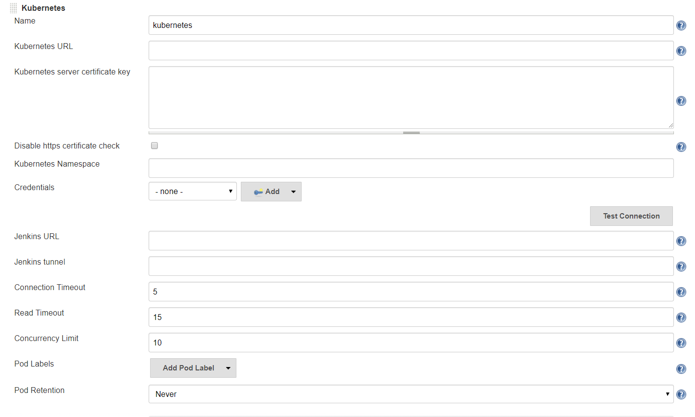

<details><summary>Kubernetes URL:</summary>
<p>
1. To begin retrieving the Kubernetes URL, log into Rancher and navigate to your cluster:

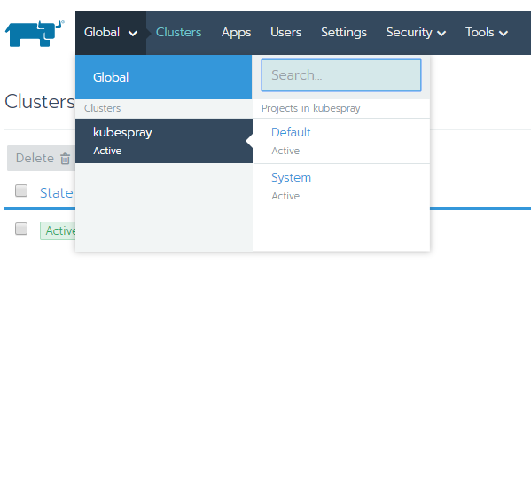

2. Click on "Launch kubectl":

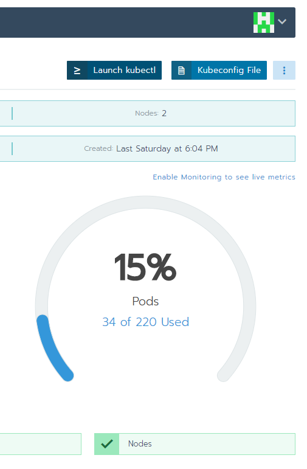

3. Execute within the shell `kubectl cluster-info` and your Kubernetes URL will be listed (highlighted):

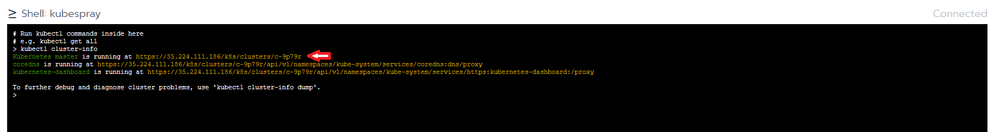

Copy this into the Kubernetes URL field.
</p>
</details>

<details><summary>Credentials:</summary>
<p>
  
1. To configure credentials so that Jenkins can authenticate with your cluster, click the top right icon and select "API and Keys":

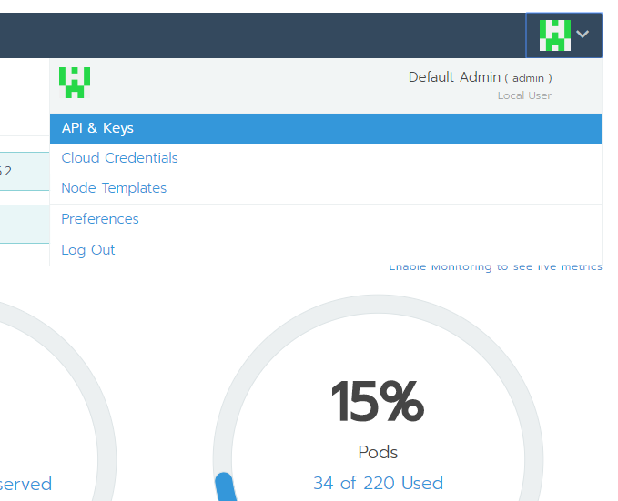

2. Click "Add Key":

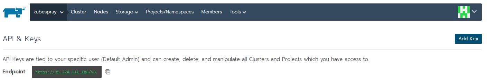

3. Enter a description e.g. "jenkins-auth" (leave the rest of the fields as they are), then click Create:

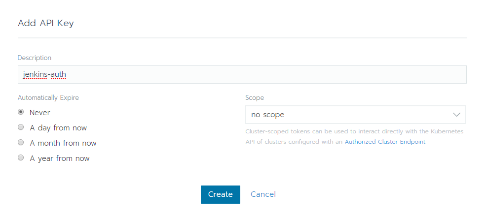

4. Save the token and secret key for the Jenkins credentials username and password respectively, we will do this next. 

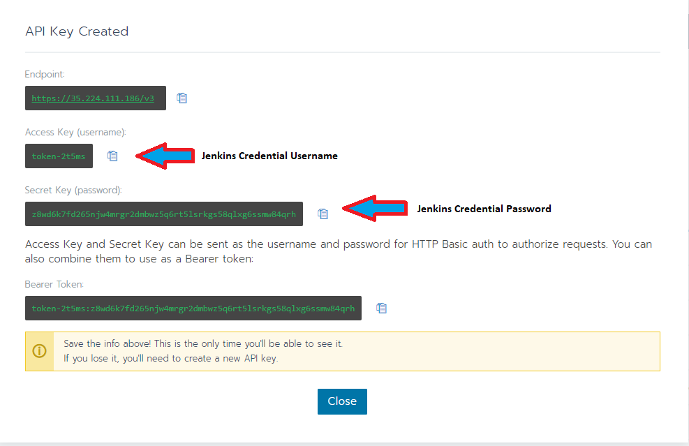

5. Go back to the Jenkins configuration and click "Credentials", then click Jenkins from the drop down:

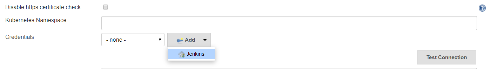

6. Enter the username and password generated by Rancher above and then click Add:

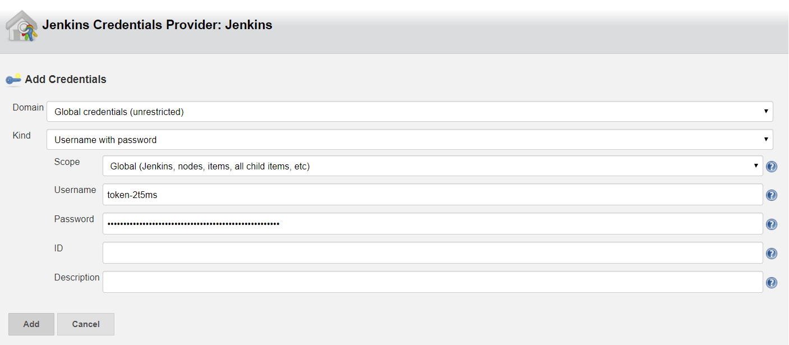

7. From the drop down select your credential and ensure you disable the https certificate check by ticking the box:

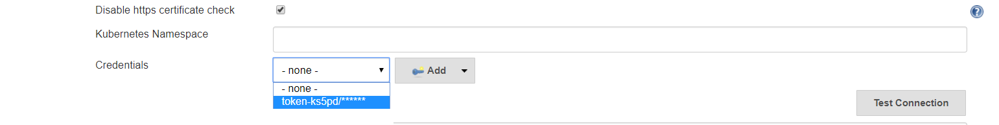

8. Click "Test Connection". It should return with success, else review your previous steps.
</p>
</details>

<details><summary>Jenkins URL:</summary>
<p>
  
1. Navigate to your cluster:


2. Click on "Launch kubectl":


3. Execute `kubectl get pods` to get the jenkins master.

4. Execute `kubectl describe pod <name of jenkins master pod>`, and copy the IP to your clipboard:

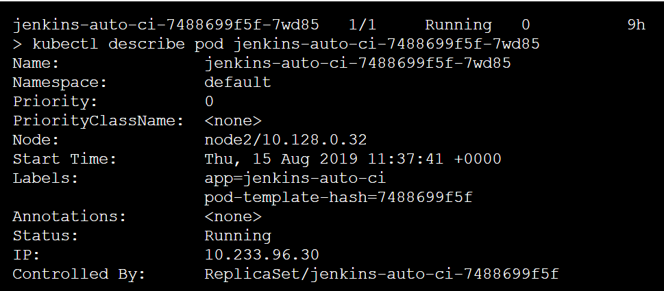

5. Copy this IP into the Jenkins URL field, followed by :80. We  follow the IP by :80 since that was the assigned containerPort in the jenkins yaml.

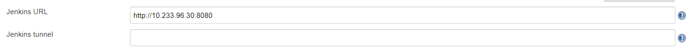
</p>
</details>

### 5.2:

Scroll further down the page  and click on 'Pod Tmplate' then click on 'Container Template', make sure all entries match the following picture:

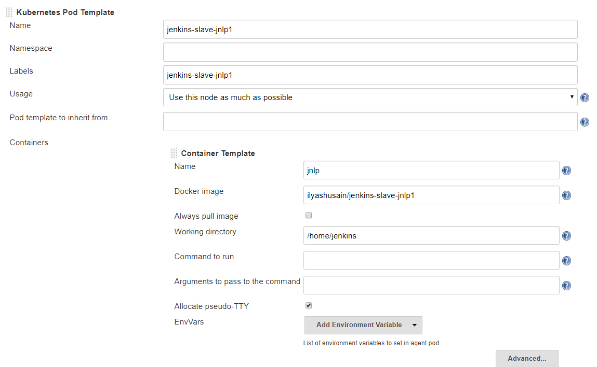

Scroll dowwn to the bottom of the page and click 'Save'.
